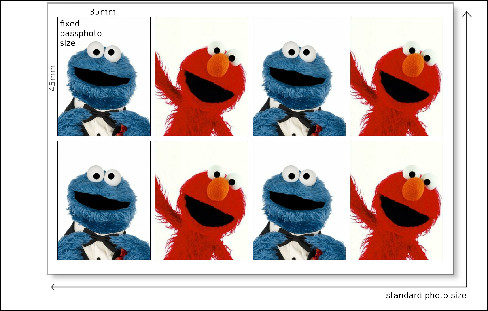

# passphoto-tiles

This script compiles pictures so a printout will have desired dimensions. It makes sure photos remain in a desired dimension and scale borders respectively for a specified paper format.

In the example a picture was dimensioned to 35x45mm (ID picture) on a standard photo size of 10x15. If the photo size is changed to 9x13, sizes and borders will adapt accordingly so the printout will have correct dimensions again.

The script uses imagemagick: 
```bash
sudo apt install imagemagick
```

Usage: 
```bash
./passphoto-tiles photo1 [photo2 ...]
```




